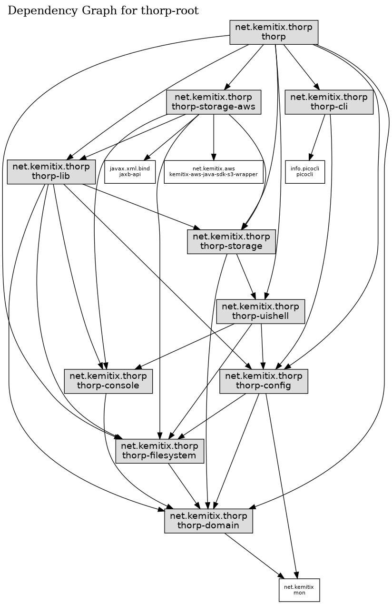

# thorp

Synchronisation of files with S3 using the hash of the file contents.

Originally based on Alex Kudlick's [aws-s3-sync-by-hash](https://github.com/akud/aws-s3-sync-by-hash).

The normal `aws s3 sync ...` command only uses the time stamp of files
to decide what files need to be copied. This utility looks at the md5
hash of the file contents.

# Usage

    $ thorp
    Usage: thorp [options]

      -V, --version         Display the version and quit
      -B, --batch           Enabled batch-mode
      -s, --source <value>  Source directory to sync to S3
      -b, --bucket <value>  S3 bucket name
      -p, --prefix <value>  Prefix within the S3 Bucket
      -P, --parallel <value> Maximum parallel upload/copy operations
      -i, --include <value> Include matching paths
      -x, --exclude <value> Exclude matching paths
      -d, --debug           Enable debug logging
      --no-global           Ignore global configuration
      --no-user             Ignore user configuration

If you don't provide a `source` the current directory will be used.

The `--include` and `--exclude` parameters can be used more than once.

The `--source` parameter can be used more than once, in which case,
all files in all sources will be consolidated into the same
bucket/prefix.

## Batch mode

Batch mode disable the ANSI console display and logs simple messages
that can be written to a file.

# Configuration

  Configuration will be read from these files:

  - Global: `/etc/thorp.conf`
  - User: `~/.config/thorp.conf`
  - Source: `${source}/.thorp.conf`

  Command line arguments override those in Source, which override
  those in User, which override those Global, which override any
  built-in config.

  When there is more than one source, only the first `.thorp.conf`
  file found will be used.

  Built-in config consists of using the current working directory as
  the `source`.

  Note, that ~include~ and ~exclude~ are cumulative across all
  configuration files.

# Caching

The last modified time for files is used to decide whether to calculate the hash values for the file. If a file has not been updated, then the hash values stored in the `.thorp.cache` file located in the root of the source is used. Otherwise the file will be read to caculate the the new hashes.

# Behaviour

When considering a local file, the following table governs what should happen:

| # | local file | remote key | hash of same key | hash of other keys | action              |
|---|------------|------------|------------------|--------------------|---------------------|
| 1 | exists     | exists     | matches          | -                  | do nothing          |
| 2 | exists     | is missing | -                | matches            | copy from other key |
| 3 | exists     | is missing | -                | no matches         | upload              |
| 4 | exists     | exists     | no match         | matches            | copy from other key |
| 5 | exists     | exists     | no match         | no matches         | upload              |
| 6 | is missing | exists     | -                | -                  | delete              |

# Executable JAR

To build as an executable jar, perform `mvn package`

This will create the file `app/target/thorp-${version}-jar-with-dependencies.jar`

Copy and rename this file into your `PATH`.

# Structure/Dependencies

